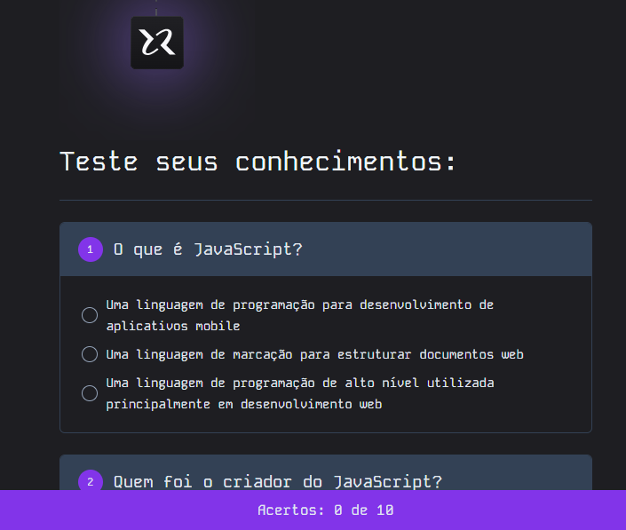

# NLW-EXPERT-html-css-javascript

Neste NWL vamos contruir um Quiz utilizando as ferramentas:

HTML  
CSS  
JAVASCRIPT  

Link para acessar o Quiz:

https://github.com/DevHeloisy/NLW-EXPERT-html-css-javascript

Imagem de como ficou depois de concluído:

---
 
